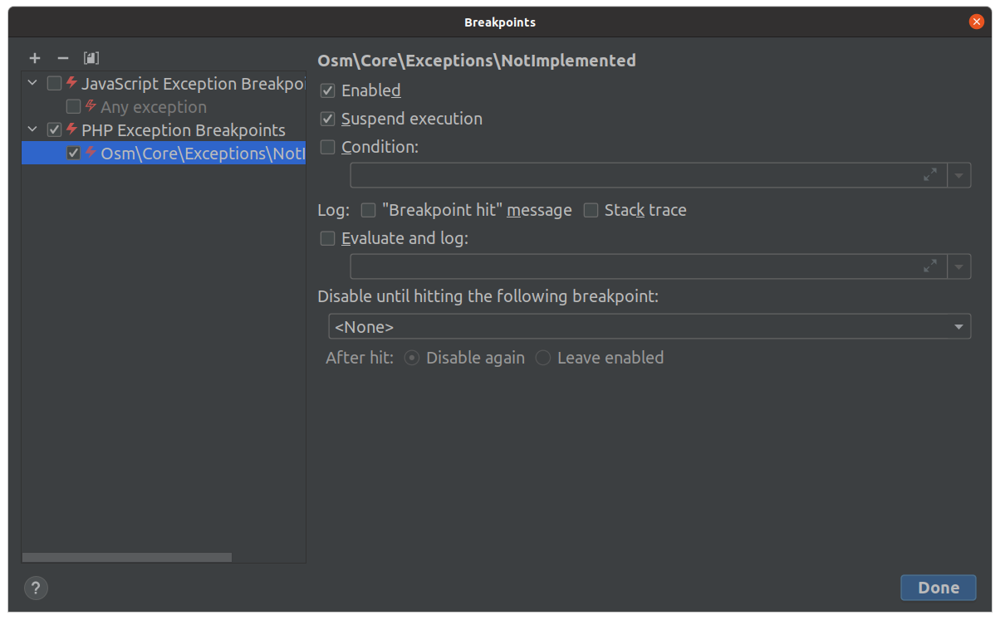

# `laravel-helper`

Helper classes and functions for Laravel.

## Installation

Add the Composer package to your project using the following command:

```shell
composer require osmianski/laravel-helper
```

## Usage

## Never forget unimplemented parts

Have you even forgotten to return to a comment like this one?

    function foo(?Bar $bar): void {
        // TODO: handle nulls
        ...
    }

Previously, I had those, too.

Not anymore.

I found that throwing the [`NotImplemented`](src/Exceptions/NotImplemented.php) exception instead of a mere comment makes you to pay off this bit of technical debt right away:

    use Osmianski\Helper\Exceptions\NotImplemented;
    ...
    
    function foo(?Bar $bar): void {
        if (!$bar) {
            throw new NotImplemented();        
        }
        
        ...
    }

Only recently, I have found a really nice feature in PhpStorm called *Exception Breakpoints*. The idea is that whenever a specified exception is thrown, the debugger stops at the line that throws the exception.

And it's a perfect match for the `NotImplemented` exception. After configuring it, the debugger stops anytime when the execution hits a feature, or a special case, that is not implemented yet.

Configure it in `Run -> View Breakpoints` by pressing `+ -> PHP Exception Breakpoints`, entering the full exception class name, and pressing OK:




## License

This package is open-sourced software licensed under the [MIT](LICENSE.md) license.
